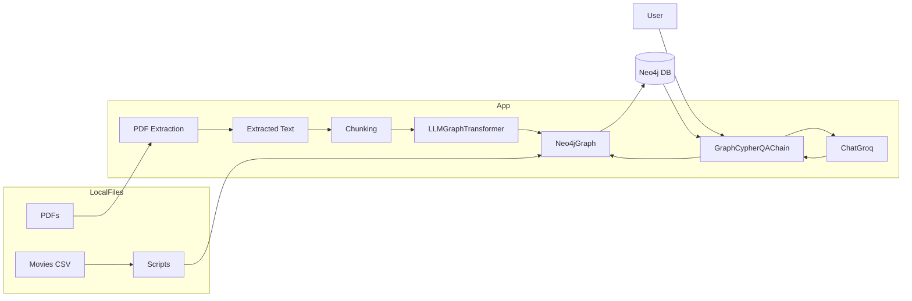
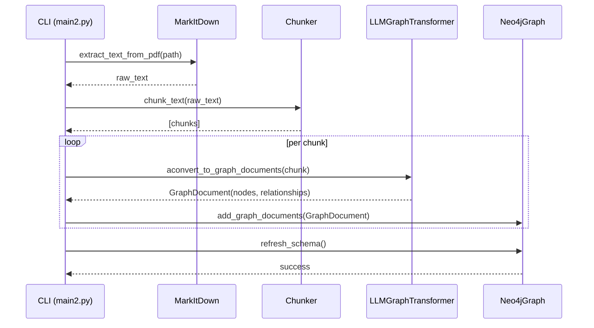
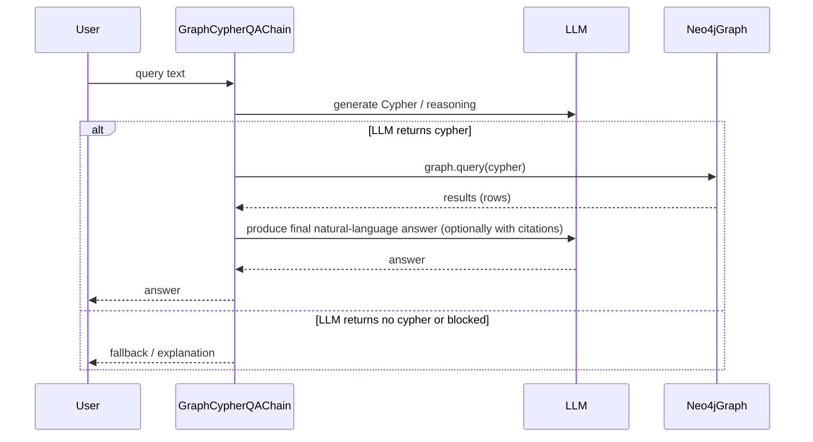
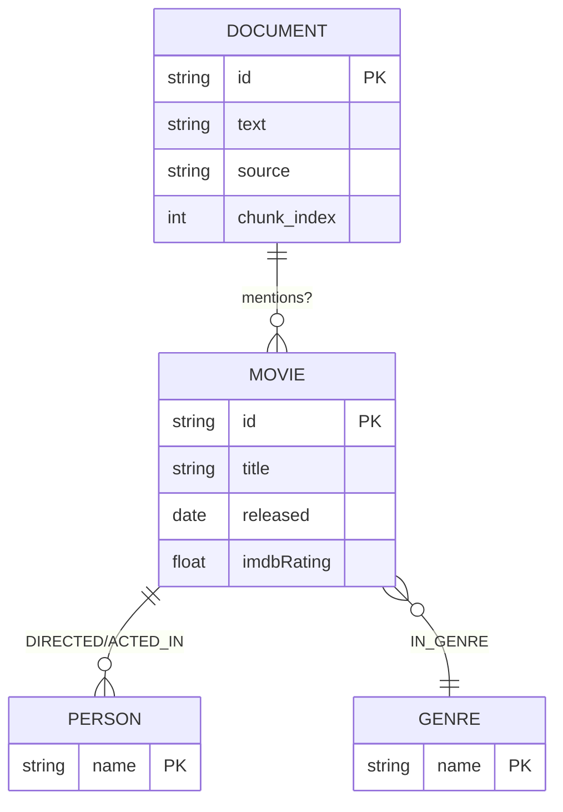

**Overview**

- **Purpose:**: Detailed design notes, diagrams, environment, run instructions, and troubleshooting for this repository.
- **Repository Root:**: Contains the Python scripts, small CSV dataset, and utilities used for ingesting documents into Neo4j and querying via an LLM-backed chain.

**Key Files**

- **main.py**: [main.py](main.py#L1) — demo for converting a short text to graph documents, ingesting movies CSV, and using GraphCypherQAChain.
- **main2.py**: [main2.py](main2.py#L1) — fuller example including PDF ingestion, safe Cypher query wrapper, LLM-based graph transformer ingestion, and a query example.
- **pdf_utils.py**: [pdf_utils.py](pdf_utils.py#L1) — PDF -> text extraction utility using MarkItDown.
- **groq_utils.py**: [groq_utils.py](groq_utils.py#L1) — (if present) helper utilities for Groq/ChatGroq usage.
- **movies_small.csv**: [movies_small.csv](movies_small.csv#L1) — small dataset used by main.py ingestion example.
- **requirements.txt**: [requirements.txt](requirements.txt#L1) — Python dependencies.

**High-level Architecture**

- **Components:**: LLM (ChatGroq), LLMGraphTransformer, Neo4jGraph (driver/wrapper), GraphCypherQAChain, PDF extraction (MarkItDown), local data (CSV, PDFs).

**Architecture Diagram (Block / Flow)**



**Sequence: PDF Ingest -> Neo4j (high-level)**



**Sequence: User Query Flow**



**Data Model (ER) — Example domain nodes & relationships**



**Detailed component descriptions**

- **ChatGroq (`ChatGroq`)**: LLM client used in these examples. It is configured in the scripts with `model` and `api_key`. The LLM is used for two roles: converting text into graph documents (via `LLMGraphTransformer`) and generating Cypher / reasoning for queries (via `GraphCypherQAChain`).
- **LLMGraphTransformer**: Transforms Documents (page_content + metadata) into GraphDocument objects containing nodes and relationships suitable for insertion into Neo4j. The code uses `aconvert_to_graph_documents` (async) and falls back to inserting Document nodes on failure.
- **Neo4jGraph**: Thin wrapper to interact with Neo4j. `graph.query(...)` executes parameterized Cypher. Note: `main2.py` replaces `graph.query` with `_safe_query` to avoid sending non-Cypher output to Neo4j.
- **GraphCypherQAChain**: Responsible for turning user queries into Cypher (via the LLM) and orchestrating query execution against the graph, then turning results into natural language answers.
- **MarkItDown (pdf_utils.py)**: PDF -> text conversion utility. `extract_text_from_pdf()` returns a plain string. Errors are converted into RuntimeError for callers.

**Important code & safety notes**

- **Safe Cypher wrapper (main2.py)**: `main2.py` defines `_safe_query` which inspects the first token of generated text and blocks any query that doesn't start with an allowed Cypher token (or a JSON-like '{'). Invalid output is saved to `generated_cypher_debug.txt` and an empty result returned. This prevents accidental CypherSyntaxError or unsafe queries.
- **Per-chunk failure fallback**: When `LLMGraphTransformer` fails for a chunk, `main2.py` writes a debug file with traceback and inserts a fallback `Document` node into Neo4j containing the chunk text.

**Environment variables & .env example**

- **Required:**: `NEO4J_URI`, `NEO4J_USERNAME`, `NEO4J_PASSWORD`, `NEO4J_DATABASE`, `GROQ_API_KEY`.
- **Optional (examples):**: `AURA_INSTANCEID`, `AURA_INSTANCENAME`.

Example .env

```
NEO4J_URI=bolt://localhost:7687
NEO4J_USERNAME=neo4j
NEO4J_PASSWORD=your_password
NEO4J_DATABASE=neo4j
GROQ_API_KEY=sk-xxxx
```

**How to run (local dev)**

- Create and activate a virtual environment, install dependencies from `requirements.txt`.
- Populate `.env` with your keys.
- Ingest movies CSV (main.py):

```bash
python main.py
```

- Ingest PDF and query (main2.py):

```bash
python main2.py
```

**Common troubleshooting**

- **Neo4j connection errors:**: Verify `NEO4J_URI`, credentials, and that the DB accepts bolt/http depending on URI. Check Neo4j logs.
- **MarkItDown failures:**: Ensure `markitdown` dependency installed and that the PDF is accessible and not corrupted. Look at stacktrace printed by `pdf_utils.py`.
- **LLM transform errors:**: `main2.py` writes chunk debug files named like `groq_chunk_error_{idx}_{ts}.txt`. Inspect these for tracebacks and the failing chunk text.
- **Blocked Cypher:**: If a generated Cypher is blocked by `_safe_query`, the text is written to `generated_cypher_debug.txt` for inspection.

**Extensions & Next steps**

- Add more robust chunking (token-based using tokenizer for the chosen LLM).
- Add retries and exponential backoff for LLM network calls.
- Add unit tests for `pdf_utils.extract_text_from_pdf`, chunker logic, and `safe_query` behavior.
- Add a small script to visualize the Neo4j schema created by `graph.refresh_schema()`.

**References & links**

- See the code examples in [main.py](main.py#L1) and [main2.py](main2.py#L1) for ingestion and query usage.
- Check [pdf_utils.py](pdf_utils.py#L1) for the PDF extraction implementation.

---

Generated on: 2026-04-01
